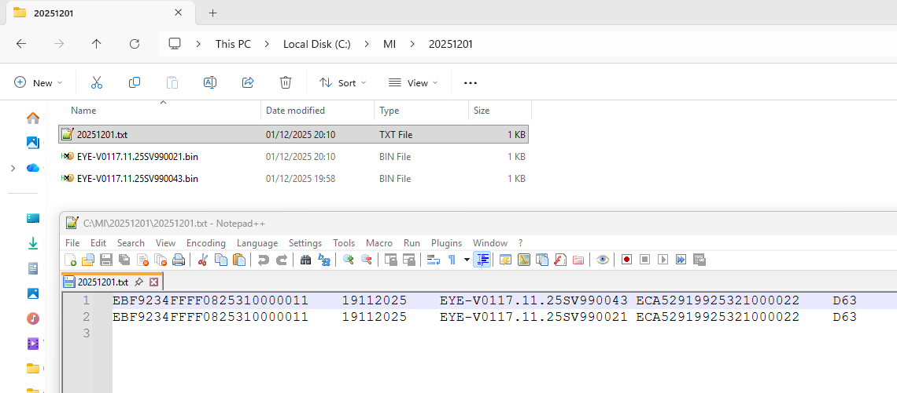
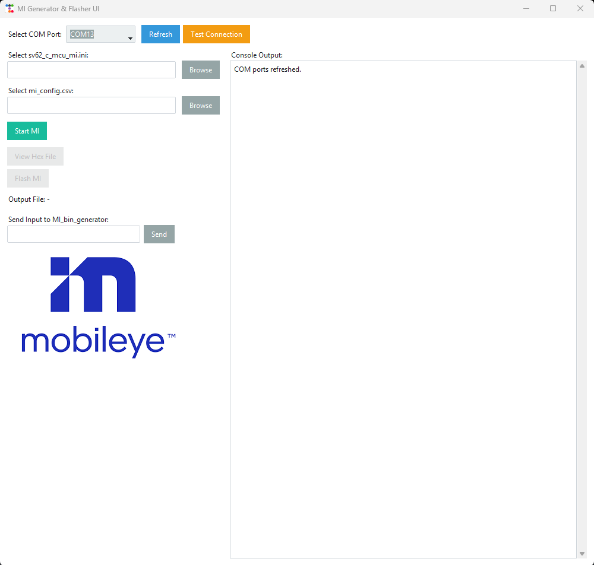

# MI Generator and Flasher UI

## Table of Contents

- [MI Generator and Flasher UI](#mi-generator-and-flasher-ui)
  - [Table of Contents](#table-of-contents)
  - [Introduction](#introduction)
  - [Folder Structure](#folder-structure)
  - [Warnings and Cautions](#warnings-and-cautions)
  - [Prerequisites](#prerequisites)
    - [Python](#python)
    - [S32 Flash Tool](#s32-flash-tool)
  - [How to Use](#how-to-use)
    - [Launching the Script](#launching-the-script)
    - [Using the Tool](#using-the-tool)
  - [](#)

---

## Introduction

The tool generates the MI bin file using `MI_bin_generator.py`.

- **Create MI bin**: filename = `<fazit_id>.bin`
- **Log all** `cm_content`, `oem_content_dynamic_1`, `oem_content_static`, and `oem_content_dynamic_2` into a text log with name as **current date**
- **Save the bin file** in the folder with **current date** as name

**Reference:**

- `cm_content` – vendor_serial_number and production_date
- `oem_content_dynamic_1` – fazit_id_string and ecu_serial_number
- `oem_content_static` – vw_ecu_hw_number
- `oem_content_dynamic_2` – vw_ecu_hw_version_number

**Example screenshot:**



---

## Folder Structure

```
Parent_Folder/
├── app/
│   ├── main_ui.py                # Master UI
│   ├── MI_bin_generator.py       # MI generator script
│   ├── sv62_c_mcu_mi.ini         # Input MI file with filled static values
│   ├── mi_config.csv             # Helper CSV
│   ├── launch.bat                # BAT file to launch UI
│   ├── images.png                # Logo
│   └── example.png               # Example screenshot
│   └── UI.png                    # UI screenshot
```

---

## Warnings and Cautions

> **Warning:** Files shall not be renamed or deleted

---

## Prerequisites

### Python

The following packages shall be installed:

- `pyserial`
- `ttkbootstrap`

### S32 Flash Tool

S32 Flash Tool shall be installed in the default location:

```
C:\NXP\S32FlashTool_2.1.2RTM
```

If installed elsewhere, update the paths in `mi_ui_app.py`:

- Lines: 195, 413
- Target and algorithm names (S32G3xxx.bin, MX66U2G45G.bin) may also need updating: 196, 197, 414

---

## How to Use

### Launching the Script

- Run the BAT file: `launch.bat`

### Using the Tool

1. Put the board in flash mode.
2. Select the COM port corresponding to the MCU.
3. Click the **Test Connection** button
   - This step is optional if running immediately after flashing without power cycle
   - **Warning:** Check SW1 and J12 settings if any errors appear in the Console Output
4. Select the INI file for the sample.
5. Select the CSV file for the sample.
6. Click **Start MI** button.
7. Enter inputs prompted in the Console Output and click **Send**.
8. Once the MI bin file is created, click the **Flash** button.
9. Click **View Hex File** button to see the bin file in hex format (optional).
10. To create MI for the next board, click **Start MI** again.

**UI screenshot:**


---
